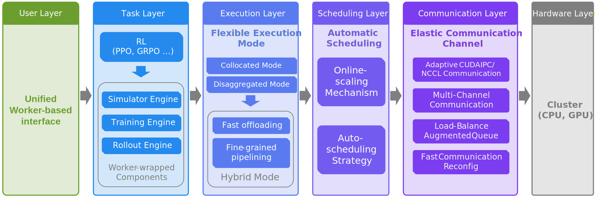

<div align="center">
  
</div>

<div align="center">
<!-- <a href="TODO"></a> -->
<a href="https://huggingface.co/RLinf"></a>
<a href="https://rlinf.readthedocs.io/en/latest/"></a>
<a href="https://rlinf.readthedocs.io/zh-cn/latest/"></a>
<a href="https://deepwiki.com/RLinf/RLinf"></a>
<a href="https://github.com/RLinf/misc/blob/main/pic/wechat.jpeg?raw=true"></a>
</div>

<h1 align="center">
  <sub>RLinf: Reinforcement Learning Infrastructure for Agentic AI</sub>
</h1>

RLinf is a flexible and scalable open-source infrastructure designed for post-training foundation models via reinforcement learning. The 'inf' in RLinf stands for `Infrastructure`, highlighting its role as a robust backbone for next-generation training. It also stands for `Infinite`, symbolizing the system’s support for open-ended learning, continuous generalization, and limitless possibilities in intelligence development.

<div align="center">
  
</div>


## What's NEW!
- [2025/08] RLinf is open-sourced. The formal v0.1 will be released soon. The paper [RLinf: Flexible and Efficient Large-scale Reinforcement Learning via Macro-to-Micro Flow Transformation]() will also be released accordingly. 

## Key Features


**RLinf is unique with:**
- Macro-to-Micro Flow: a new paradigm M2Flow, which executes macro-level logical flows through micro-level execution flows, decoupling logical workflow construction (programmable) from physical communication and scheduling (efficiency).

- Flexible Execution Modes

  - Collocated mode: shares all GPUs across all workers.
  - Disaggregated mode: enables fine-grained pipelining.
  - Hybrid mode: a customizable combination of different placement modes, integrating both collocated and disaggregated modes.

- Auto-scheduling Strategy: automatically selects the most suitable execution mode based on the training workload, without the need for manual resource allocation.
  
- Embodied Agent Support
  - Fast adaptation support for mainstream VLA models: [OpenVLA](https://github.com/openvla/openvla), [OpenVLA-OFT](https://github.com/moojink/openvla-oft), and [π₀](https://github.com/Physical-Intelligence/openpi).
  - Support for mainstream CPU & GPU-based simulators via standardized RL interfaces: [ManiSkill3](https://github.com/haosulab/ManiSkill), [LIBERO](https://github.com/Lifelong-Robot-Learning/LIBERO).
  - Enabling the first RL fine-tuning of the $\pi_0$ model family with a flow-matching action expert.

**RLinf is fast with:**

- Hybrid mode with fine-grained pipelining: achieves a **120%+** throughput improvement compared to other frameworks.
- Automatic Online Scaling Strategy: dynamically scales training resources, with GPU switching completed within seconds, further improving efficiency by 20–40% while preserving the on-policy nature of RL algorithms.

**RLinf is flexible and easy to use with:**

- Multiple Backend Integrations

  - FSDP + Hugging Face: rapid adaptation to new models and algorithms, ideal for beginners and fast prototyping.
  - Megatron + SGLang: optimized for large-scale training, delivering maximum efficiency for expert users with demanding workloads.

- Adaptive communication via the asynchronous communication channel

- Built-in support for popular RL methods, including [PPO](https://arxiv.org/abs/1707.06347), [GRPO](https://arxiv.org/abs/2402.03300), [DAPO](https://arxiv.org/abs/2503.14476), [Reinforce++](https://arxiv.org/abs/2501.03262), and more.

## Main Results
### Embodied Intelligence

<div align="center">
<table>
  <tr>
    <th colspan="5" style="text-align:center;"><strong>OpenVLA-OFT model results on ManiSkill3</strong></th>
  </tr>
  <tr>
    <th>Model</th>
    <th>Vision</th>
    <th>Semantic</th>
    <th>Position</th>
    <th>Average</th>
  </tr>
  <tr>
    <td><a href="https://huggingface.co/gen-robot/openvla-7b-rlvla-warmup">rl4vla</a></td>
    <td>76.6%</td>
    <td>75.4%</td>
    <td>77.6%</td>
    <td>76.1%</td>
  </tr>
  <tr>
    <td><a href="https://huggingface.co/RLinf/RLinf-OpenVLAOFT-GRPO-ManiSkill3-25ood">GRPO-OpenVLA-OFT</td>
    <td><strong>84.6%</strong></td>
    <td>51.6%</td>
    <td>42.9%</td>
    <td>61.5%</td>
  </tr>
  <tr>
    <td><a href="https://huggingface.co/RLinf/RLinf-OpenVLAOFT-PPO-ManiSkill3-25ood">PPO-OpenVLA-OFT</td>
    <td>80.5%</td>
    <td>56.6%</td>
    <td>56.1%</td>
    <td>64.5%</td>
  </tr>
  <tr>
    <td><a href="https://huggingface.co/RLinf/RLinf-OpenVLA-PPO-ManiSkill3-25ood">PPO-OpenVLA</td>
    <td>82.0%</td>
    <td><strong>80.6%</strong></td>
    <td><strong>89.3%</strong></td>
    <td><strong>82.2%</strong></td>
  </tr>
  <tr>
    <td><a href="https://huggingface.co/RLinf/RLinf-OpenVLA-GRPO-ManiSkill3-25ood">GRPO-OpenVLA</td>
    <td>74.7%</td>
    <td>74.4%</td>
    <td>81.6%</td>
    <td>75.5%</td>
  </tr>
</table>

<table>
  <tr>
    <th colspan="6" style="text-align:center;"><strong>OpenVLA-OFT model results on LIBERO</strong></th>
  </tr>
  <tr>
    <th>Model</th>
    <th><a href="https://huggingface.co/RLinf/RLinf-OpenVLAOFT-GRPO-LIBERO-spatial">Spatial</a></th>
    <th><a href="https://huggingface.co/RLinf/RLinf-OpenVLAOFT-GRPO-LIBERO-goal">Goal</a></th>
    <th><a href="https://huggingface.co/RLinf/RLinf-OpenVLAOFT-GRPO-LIBERO-object">Object</a></th>
    <th><a href="https://huggingface.co/RLinf/RLinf-OpenVLAOFT-GRPO-LIBERO-long">Long</a></th>
    <th>Average</th>
  </tr>
  <tr>
    <td>OpenVLA-OFT-SFT (one-shot)</td>
    <td>56.5%</td>
    <td>45.6%</td>
    <td>25.6%</td>
    <td>9.7%</td>
    <td>34.4%</td>
  </tr>
  <tr>
    <td>OpenVLA-OFT-RLinf</td>
    <td><strong>99.0%</strong></td>
    <td><strong>99.0%</strong></td>
    <td><strong>99.0%</strong></td>
    <td><strong>94.4%</strong></td>
    <td><strong>97.9%</strong></td>
  </tr>
  <tr>
    <td>Improvement</td>
    <td>+42.5%</td>
    <td>+53.4%</td>
    <td>+73.4%</td>
    <td>+84.7%</td>
    <td>+63.5%</td>
  </tr>
</table>
</div>

- RLinf supports both PPO and GRPO algorithms, enabling state-of-the-art training for Vision-Language-Action models.
- The framework provides seamless integration with mainstream embodied intelligence benchmarks, including ManiSkill3 and LIBERO, and achieves strong performance across diverse evaluation metrics.


### Math Reasoning

<div align="center">
<table>
  <tr>
    <th colspan="5" style="text-align:center;"><strong>1.5B model results</strong></th>
  </tr>
  <tr>
    <th>Model</th>
    <th><a href="https://huggingface.co/datasets/RLinf/AIME24">AIME 24</a></th>
    <th><a href="https://huggingface.co/datasets/RLinf/AIME25">AIME 25</a></th>
    <th><a href="https://huggingface.co/datasets/RLinf/GPQA-diamond">GPQA-diamond</a></th>
    <th>Average</th>
  </tr>
  <tr>
    <td><a href="https://huggingface.co/deepseek-ai/DeepSeek-R1-Distill-Qwen-1.5B">DeepSeek-R1-Distill-Qwen-1.5B (base model)</a></td>
    <td>28.33</td><td>24.90</td><td>27.45</td><td>26.89</td>
  </tr>
  <tr>
    <td><a href="https://huggingface.co/zwhe99/DeepMath-1.5B">DeepMath-1.5B</a></td>
    <td>37.80</td><td>30.42</td><td>32.11</td><td>33.44</td>
  </tr>
  <tr>
    <td><a href="https://huggingface.co/agentica-org/DeepScaleR-1.5B-Preview">DeepScaleR-1.5B-Preview</a></td>
    <td>40.41</td><td>30.93</td><td>27.54</td><td>32.96</td>
  </tr>
  <tr>
    <td><a href="https://huggingface.co/inclusionAI/AReaL-1.5B-Preview-Stage-3">AReaL-1.5B-Preview-Stage-3</a></td>
    <td>40.73</td><td>31.56</td><td>28.10</td><td>33.46</td>
  </tr>
  <tr>
    <td>AReaL-1.5B-retrain*</td>
    <td>44.42</td><td>34.27</td><td>33.81</td><td>37.50</td>
  </tr>
  <tr>
    <td><a href="https://huggingface.co/Nickyang/FastCuRL-1.5B-V3">FastCuRL-1.5B-V3</a></td>
    <td>43.65</td><td>32.49</td><td>35.00</td><td>37.05</td>
  </tr>
  <tr>
    <td><a href="https://huggingface.co/RLinf/RLinf-math-1.5B"><strong>RLinf-math-1.5B</strong></a></td>
    <td><strong>48.44</strong></td><td><strong>35.63</strong></td><td><strong>38.46</strong></td><td><strong>40.84</strong></td>
  </tr>
</table>
</div>

\* We retrain the model using the default settings for 600 steps.

<div align="center">
<table>
  <tr>
    <th colspan="5" style="text-align:center;"><strong>7B model results</strong></th>
  </tr>
  <tr>
    <th>Model</th>
    <th><a href="https://huggingface.co/datasets/RLinf/AIME24">AIME 24</a></th>
    <th><a href="https://huggingface.co/datasets/RLinf/AIME25">AIME 25</a></th>
    <th><a href="https://huggingface.co/datasets/RLinf/GPQA-diamond">GPQA-diamond</a></th>
    <th>Average</th>
  </tr>
  <tr>
    <td><a href="https://huggingface.co/deepseek-ai/DeepSeek-R1-Distill-Qwen-7B">DeepSeek-R1-Distill-Qwen-7B (base model)</a></td>
    <td>54.90</td><td>40.20</td><td>45.48</td><td>46.86</td>
  </tr>
  <tr>
    <td><a href="https://huggingface.co/inclusionAI/AReaL-boba-RL-7B">AReaL-boba-RL-7B</a></td>
    <td>61.66</td><td>49.38</td><td>46.93</td><td>52.66</td>
  </tr>
  <tr>
    <td><a href="https://huggingface.co/Skywork/Skywork-OR1-7B">Skywork-OR1-7B</a></td>
    <td>66.87</td><td>52.49</td><td>44.43</td><td>54.60</td>
  </tr>
  <tr>
    <td><a href="https://huggingface.co/POLARIS-Project/Polaris-7B-Preview">Polaris-7B-Preview</a></td>
    <td><strong>68.55</strong></td><td>51.24</td><td>43.88</td><td>54.56</td>
  </tr>
  <tr>
    <td><a href="https://huggingface.co/nvidia/AceMath-RL-Nemotron-7B">AceMath-RL-Nemotron-7B</a></td>
    <td>67.30</td><td><strong>55.00</strong></td><td>45.57</td><td>55.96</td>
  </tr>
  <tr>
    <td><a href="https://huggingface.co/RLinf/RLinf-math-7B"><strong>RLinf-math-7B</strong></a></td>
    <td>68.33</td><td>52.19</td><td><strong>48.18</strong></td><td><strong>56.23</strong></td>
  </tr>
</table>
</div>

- RLinf achieves state-of-the-art performance on math reasoning tasks, consistently outperforming existing models across multiple benchmarks (AIME 24, AIME 25, GPQA-diamond) for both 1.5B and 7B model sizes.

## Roadmap

### 1. System-Level Enhancements
- [ ] Support for heterogeneous GPUs  
- [ ] Support for asynchronous pipeline execution  
- [ ] Support for Mixture of Experts (MoE)  
- [ ] Support for vLLM inference backend

### 2. Application-Level Extensions
- [ ] Support for Vision-Language Models (VLMs) training  
- [ ] Support for deep searcher agent training  
- [ ] Support for multi-agent training  
- [ ] Support for integration with more embodied simulators (e.g., [Meta-World](https://github.com/Farama-Foundation/Metaworld), [GENESIS](https://github.com/Genesis-Embodied-AI/Genesis))  
- [ ] Support for more Vision Language Action models (VLAs), such as [GR00T](https://github.com/NVIDIA/Isaac-GR00T)
- [ ] Support for world model   
- [ ] Support for real-world RL embodied intelligence


## Getting Started 

Complete documentation for RLinf can be found [**Here**](https://rlinf.readthedocs.io/en/latest/).

**Quickstart**

  - [Installation](https://rlinf.readthedocs.io/en/latest/rst_source/start/installation.html)
  - [Quickstart 1: PPO Training of VLAs on Maniskill3](https://rlinf.readthedocs.io/en/latest/rst_source/start/vla.html)
  - [Quickstart 2: GRPO Training of LLMs on MATH](https://rlinf.readthedocs.io/en/latest/rst_source/start/llm.html)
  - [Multi-node Training](https://rlinf.readthedocs.io/en/latest/rst_source/start/distribute.html)
  - [Model Evaluation](https://rlinf.readthedocs.io/en/latest/rst_source/start/eval.html)

**Key Design**
  - [Unified User Interface Usage](https://rlinf.readthedocs.io/en/latest/rst_source/tutorials/user/index.html)
  - [Flexible Execution Modes](https://rlinf.readthedocs.io/en/latest/rst_source/tutorials/mode/index.html)
  - [Enable Automatic Scheduling](https://rlinf.readthedocs.io/en/latest/rst_source/tutorials/scheduler/index.html)
  - [Elastic Communication](https://rlinf.readthedocs.io/en/latest/rst_source/tutorials/communication/index.html)

**Example Gallery**

  - [Embodied Intelligence Vision-Language-Action Model training](https://rlinf.readthedocs.io/en/latest/rst_source/examples/embodied.html)
  - [Math Reasoning Model Training](https://rlinf.readthedocs.io/en/latest/rst_source/examples/reasoning.html)

**Advanced Features**

  - [5D Parallelism Configuration for Megatron-LM](https://rlinf.readthedocs.io/en/latest/rst_source/tutorials/advance/5D.html)
  - [LoRA Integration for efficient fine-tuning](https://rlinf.readthedocs.io/en/latest/rst_source/tutorials/advance/lora.html)
  - [Switch between different versions of SGLang](https://rlinf.readthedocs.io/en/latest/rst_source/tutorials/advance/version.html)
  - [Checkpoint Resume and Recovery Support](https://rlinf.readthedocs.io/en/latest/rst_source/tutorials/advance/resume.html)

**Extending The Framework:**

  - [Adding new Environments](https://rlinf.readthedocs.io/en/latest/rst_source/tutorials/extend/new_env.html)
  - [Adding new Models with FSDP+Huggingface backend](https://rlinf.readthedocs.io/en/latest/rst_source/tutorials/extend/new_model_fsdp.html)
  - [Adding new Models with Megatron+SGLang backend](https://rlinf.readthedocs.io/en/latest/rst_source/tutorials/extend/new_model_megatron.html)

**Blogs**

  - [Comparison with VeRL](https://rlinf.readthedocs.io/en/latest/rst_source/blog/compare_with_verl.html)

## Build Status

| Type             | Status |
| :--------------: | :----: |
| Reasoning RL-MATH | [](https://github.com/RLinf/RLinf/actions/workflows/math_e2e.yml) |
| Embodied RL-VLA   | [](https://github.com/RLinf/RLinf/actions/workflows/embodied_e2e.yml) |


## Contribution Guidelines
We welcome contributions to RLinf. Please read [contribution guide](https://rlinf.readthedocs.io/en/latest/index.html#contribution-guidelines) before taking action.

## Citation and Acknowledgement

If you find **RLinf** helpful, please cite the GitHub repository:

```bibtex
@misc{RLinf_repo,
  title        = {RLinf: Reinforcement Learning Infrastructure for Agentic AI},
  howpublished = {\url{https://github.com/RLinf/RLinf}},
  note         = {GitHub repository},
  year         = {2025}
}
```

**Paper**: A full paper describing RLinf will be released by **September 20, 2025**. We will update this section with the official citation and BibTeX when they become available.

**Acknowledgements**
RLinf has been inspired by, and benefits from, the ideas and tooling of the broader open-source community.
In particular, we would like to thank the teams and contributors behind VeRL, AReaL, Megatron-LM, SGLang, and PyTorch Fully Sharded Data Parallel (FSDP), and if we have inadvertently missed your project or contribution, please open an issue or a pull request so we can properly credit you.

**Contact:**
We welcome applications from Postdocs, PhD/Master's students, and interns. Join us in shaping the future of RL infrastructure and embodied AI!
- Chao Yu: zoeyuchao@gmail.com
- Yu Wang: yu-wang@tsinghua.edu.cn